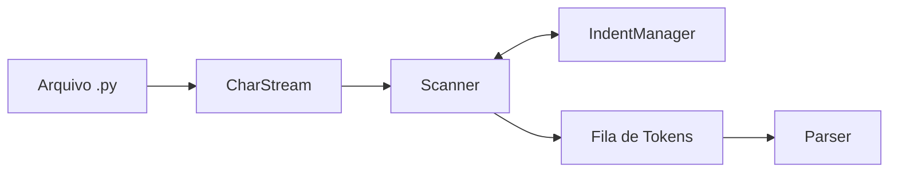

# Arquitetura do Scanner (Analisador Léxico)

O **Scanner** é a primeira fase do compilador **PyToJava**. Ele percorre o código-fonte Python caractere a caractere e o transforma em uma sequência de **tokens** prontos para o *parser*. Nesta fase, o texto bruto deixa de ser apenas uma cadeia de caracteres e passa a ser uma **fila ordenada de unidades léxicas**, cada uma com tipo, lexema e posição (linha e coluna).

O ciclo de vida dos dados na análise léxica é:

1. O arquivo `.py` é aberto e encapsulado por um **`CharStream`**, que expõe os caracteres um a um.
2. O **`Scanner`** consome esses caracteres e aplica os autômatos de reconhecimento, sempre pelo princípio do **maior casamento** (*maximal munch*).
3. Quando encontra mudança de recuo, o `Scanner` consulta o **`IndentManager`**, que controla a pilha de indentação e informa se devem ser emitidos `INDENT` ou `DEDENT`.
4. Cada token reconhecido é enfileirado na **Fila de Tokens**.
5. O **`Parser`** (fase seguinte) retira tokens dessa fila para montar a Árvore de Sintaxe Abstrata (AST).

!!! info "Escopo procedural (sem Orientação a Objetos)"
    O PyToJava cobre o paradigma **procedural/estruturado** — funções, variáveis, condicionais (`if`/`elif`/`else`) e laços (`while`) — e **não** suporta Orientação a Objetos, o que mantém a complexidade controlada.

    Conceitualmente, o projeto usa o **Flex** e o **Bison** como modelos de referência, embora a implementação seja em Python puro:

    - **Modelo Flex (léxico):** o `Scanner` se comporta como um **autômato finito determinístico**, reconhecendo o maior padrão possível (*maximal munch*) em cada passo.
    - **Modelo Bison (sintático):** o `Parser` consome a **fila de tokens** gerada pelo scanner, de forma análoga a uma gramática que lê símbolos um a um.

## Diagrama de Arquitetura



O `Scanner` conversa com o `IndentManager` a cada mudança de linha: é ele quem decide, com base na pilha de recuo, se um `INDENT` ou `DEDENT` deve ser inserido no fluxo antes do próximo token.

### Exemplo Prático de Fluxo (`basic_math.py`)

Para ilustrar o funcionamento do diagrama acima, considere o seguinte arquivo `examples/basic_math.py`:

```python
x = 10
y = 20
total = x + y
```

O processamento ocorre passo a passo:

1. **`Arquivo .py` → `CharStream`:** o arquivo é aberto e o `CharStream` passa a entregar um caractere por vez, mantendo o controle de `linha` e `coluna`.
2. **`CharStream` → `Scanner`:** o `Scanner` lê `x` e, pelo *maximal munch*, para no espaço e emite `IDENTIFIER` (`x`). Em seguida lê `=`, mas como o próximo caractere não é `=`, emite `OP_ASSIGN`; depois lê `10` e emite `INT_LITERAL`.
3. **Mudança de linha → `IndentManager`:** ao encontrar o fim da linha, o scanner emite `NEWLINE`. Como o recuo continua em `0` (igual ao topo da pilha), o `IndentManager` **não** emite `INDENT` nem `DEDENT`.
4. **Repetição nas linhas 2 e 3:** o mesmo processo gera os tokens de `y = 20` e de `total = x + y`. Em `x + y`, o `+` vira `OP_PLUS` e cada identificador vira `IDENTIFIER`.
5. **`Scanner` → `Fila de Tokens`:** cada token reconhecido é enfileirado na ordem de leitura, formando o fluxo abaixo.
6. **`Fila de Tokens` → `Parser`:** o `Parser` consome a fila, token a token, e monta a Árvore de Sintaxe Abstrata (AST).

Fila de tokens resultante:

```
IDENTIFIER(x), OP_ASSIGN, INT_LITERAL(10), NEWLINE,
IDENTIFIER(y), OP_ASSIGN, INT_LITERAL(20), NEWLINE,
IDENTIFIER(total), OP_ASSIGN, IDENTIFIER(x), OP_PLUS, IDENTIFIER(y), NEWLINE,
EOF
```

Como o arquivo não possui blocos indentados, a pilha permanece em `0` até o fim: nenhum `DEDENT` é emitido e a análise é encerrada com `EOF`.

## Módulos do Scanner & API Pública

| Módulo | Responsabilidade |
| :--- | :--- |
| `CharStream` | Leitura caractere a caractere, rastreando `linha` e `coluna`. |
| `IndentManager` | Controle da pilha para emissão dos tokens sintéticos `INDENT` e `DEDENT`. |
| `Scanner` | Núcleo do reconhecimento; expõe a API pública `nextToken()`. |

### CharStream

Encapsula o texto-fonte e entrega **um caractere por vez** ao scanner. Mantém internamente o **cursor**, a **linha** e a **coluna** atuais, permitindo que qualquer erro ou token reporte a posição exata no arquivo. Também sinaliza quando o fim do fluxo foi atingido.

### IndentManager

Guarda a **pilha de níveis de recuo** (iniciada em `0`). A cada nova linha lógica, compara o recuo lido com o topo da pilha e determina:

- recuo maior → empilha e sinaliza um `INDENT`;
- recuo menor → desempilha e sinaliza um ou mais `DEDENT`;
- recuo inexistente na pilha → erro léxico de indentação.

### Scanner / API Pública

O ponto de entrada é:

```python
def nextToken() -> Token:
    ...
```

A cada chamada, o `Scanner`:

1. descarta espaços, comentários (`#`) e linhas vazias;
2. aplica a regra do **maior casamento** (*maximal munch*), escolhendo o token mais longo possível;
3. consulta o `IndentManager` quando há mudança de recuo;
4. retorna o próximo **`Token` válido** (com tipo, lexema, linha e coluna) ou lança um **erro léxico**.

## Tratamento de Fim de Arquivo (EOF)

Ao atingir o fim do arquivo, o scanner encerra a análise emitindo:

1. um token **`DEDENT`** para cada nível ainda presente na pilha de indentação (acima de `0`), fechando todos os blocos abertos;
2. um token **`NEWLINE`**, caso a última linha lógica não tenha sido finalizada;
3. por fim, o token **`EOF`**, que sinaliza ao `Parser` que não há mais tokens.

Esse comportamento garante que a fila de tokens sempre represente blocos **balanceados**, mesmo que o arquivo termine dentro de um bloco indentado.

## Guia de Execução Local

Execute os comandos a partir da raiz do projeto.

**Testes unitários do caso feliz do léxico:**

```bash
pytest tests/test_lexer_happy_path.py
```

**Execução do scanner sobre um arquivo de exemplo:**

```bash
python -m src.main examples/basic_math.py
```

O arquivo `examples/basic_math.py` contém um programa procedural simples (aritmética e atribuições) usado para validar o reconhecimento de tokens ponta a ponta.
